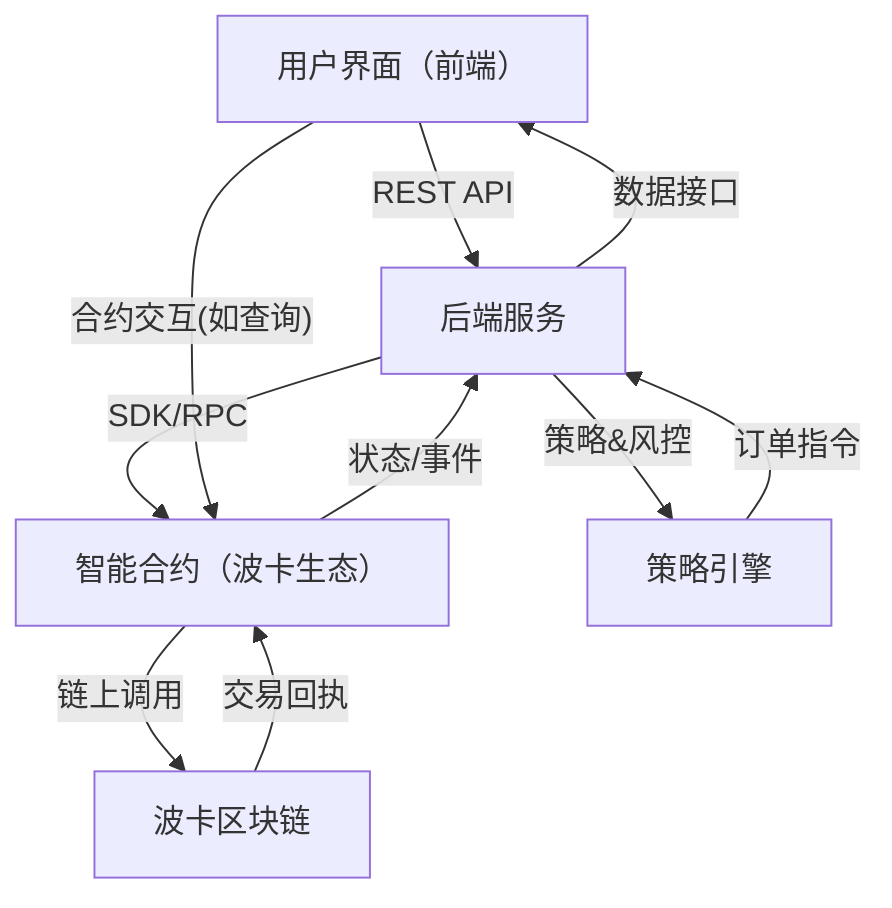

# 自动化交易系统（atrade）架构文档

## 一、系统架构概述

本系统分为三大模块：前端、后端、合约。各模块分工明确，通过标准接口进行数据交互。

- **前端**：负责用户交互、策略配置、数据展示。
- **后端**：负责策略引擎、订单管理、风控、与区块链交互。
- **合约**：基于波卡生态，负责链上自动化交易逻辑。

## 二、目录结构建议

- frontend/  前端代码
- backend/   后端服务
- contracts/ 智能合约

## 三、数据交互架构图

## 四、模块说明

### 1. 前端
- 用户登录、策略配置、交易监控、数据展示
- 调用后端RESTful API

### 2. 后端
- 策略引擎：策略执行、回测、风控
- 订单管理：下单、撤单、订单状态跟踪
- 区块链交互：通过SDK或RPC与波卡链通信

### 3. 智能合约（波卡生态）
- 实现自动化交易核心逻辑，保障交易透明与不可篡改
- 支持策略参数、订单等链上存储与调用
- 提供事件通知，供后端和前端监听
- 可支持前端直接查询链上数据（如资产、订单状态等）

## 五、数据流说明

1. 用户通过前端配置策略，前端调用后端API。
2. 后端根据策略生成订单，调用智能合约进行链上操作。
3. 智能合约与波卡区块链交互，完成交易并产生事件。
4. 后端监听合约事件，处理链上回执并同步状态。
5. 前端可通过后端或直接与智能合约交互，查询链上资产、订单等信息。
6. 前端实时展示交易状态与资产信息。

## 六、行业案例参考与架构借鉴

本系统架构设计参考了波卡生态下的主流自动化交易平台（如 Polkadex、HydraDX、Acala 等）相关文档和开源实现，主要借鉴了以下架构要点：

- 前端可通过后端或直接与智能合约交互，提升用户体验和链上透明度。
- 后端作为策略执行与风控核心，负责链下复杂逻辑和链上交互的桥梁。
- 智能合约负责链上资产管理、订单撮合、事件通知等，保障安全与透明。
- 波卡区块链作为底层基础设施，提供高性能和可扩展的链上环境。

### 参考资料

- [Polkadex Architecture](https://docs.polkadex.trade/architecture/overview)
- [Acala Whitepaper](https://acala.network/whitepaper)
- [HydraDX Docs](https://docs.hydradx.io/)

本项目架构在上述行业实践基础上，结合自身业务需求进行定制和优化。

---
