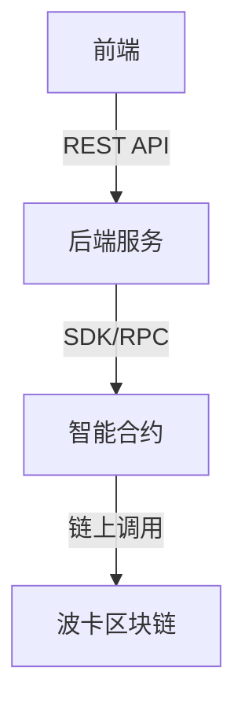

# 后端模块

## 主要功能
- 策略引擎与风控
- 订单管理与撮合
- 区块链交互（与智能合约、波卡链）
- 提供RESTful API与WebSocket服务
- 用户与权限管理

## 技术栈推荐
- 语言：Node.js（推荐）、Python
- 框架：Express.js、Koa、FastAPI
- 数据库：PostgreSQL、MongoDB
- 区块链SDK：@polkadot/api、ethers.js
- 消息队列：RabbitMQ、Kafka（可选）

## 架构图

