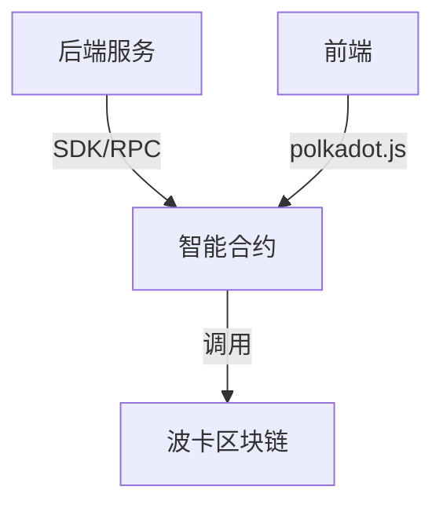

# 智能合约模块

## 主要功能
- 自动化交易核心逻辑
- 策略参数、订单等链上存储
- 事件通知与链上状态管理
- 资产安全与透明

## 技术栈推荐
- 合约语言：Ink!（推荐，基于Rust，适用于Substrate/波卡生态）
- 开发框架：Substrate Contracts Node、cargo-contract
- 测试工具：Polkadot.js、Substrate Playground

## 架构图

