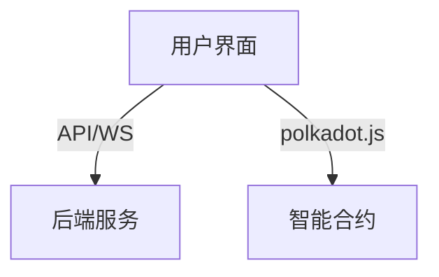

# 前端模块

## 主要功能
- 用户登录与权限管理
- 策略配置与回测
- 交易监控与数据展示
- 实时资产与订单状态查询

## 技术栈推荐
- 框架：React.js（推荐）、Vue.js
- 状态管理：Redux、MobX 或 Vuex
- UI组件库：Ant Design、Material UI
- 网络请求：Axios、Fetch
- Web3交互：polkadot.js/api

## 架构图

